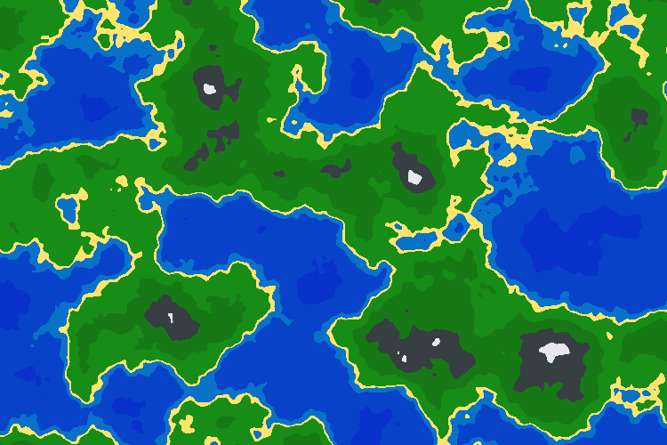

# Terrain Map Generator in Go

make a random, procedurally generated image of a terrain map

## Examples

check out the examples directory for an example of how to generate a random terrain map image with default settings (saves as map.png in current directory)
